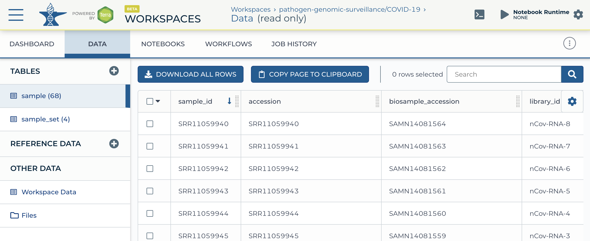

```{r, include = FALSE}
knitr::opts_chunk$set(
    eval = AnVIL::gcloud_exists(), collapse = TRUE, cache = TRUE
)
options(width=75)
```

# Installation

Install the _AnVIL_ package with

```{r, eval = FALSE}
if (!requireNamespace("BiocManager", quietly = TRUE))
    install.packages("BiocManager", repos = "https://cran.r-project.org")
BiocManager::install("AnVIL")
```

Once installed, load the package with

```{r, message =FALSE, eval = TRUE, cache = FALSE}
library(AnVIL)
```

# Quick start

## Up to speed with _AnVIL_

The [AnVIL project][] is an analysis, visualization, and informatics
cloud-based space for data access, sharing and computing across large
genomic-related data sets.

The _AnVIL_ project supports use of _R_ through Jupyter notebooks and
_RStudio_. Support for _RStudio_ is preliminary as of April 2020.

This package provides access to _AnVIL_ resources from within the
_AnVIL_ cloud, and also from stand-alone computing resources such as a
user's laptop.

Use of this package requires AnVIL and Google cloud computing billing
accounts. Consult [AnVIL training guides][] for details on
establishing these accounts.

The remainder of this vignette assumes that an AnVIL account has been
established and successfully linked to a Google cloud computing
billing account.

[AnVIL project]: https://anvilproject.org/
[AnVIL training guides]: https://anvilproject.org/training/guides

## Use in the AnVIL cloud

In the AnVIL cloud environment, click on the `RUNTIME` button
illustrated below and choose the 'Bioconductor' runtime. When creating
a Jupyter notebook, choose `R` as the engine. For _RStudio_ use,
choose `Custom environment` and enter the current
`anvil-rstudio-bioconductor` image and version tag. A time of writing,
the image is

```
us.gcr.io/anvil-gcr-public/anvil-rstudio-bioconductor:0.0.3
```
Images are available at Google Cloud Platform [container registry][].

[container registry]: http://us.gcr.io/anvil-gcr-public/anvil-rstudio-bioconductor

## Local use

Local use requires that the gcloud SDK is installed, and that the
billing account used by AnVIL can be authenticated with the
user. These requirements are satisfied when using the AnVIL compute
cloud. For local use, one must

- [Install][install-gcloud-sdk] the gcloud sdk
- Define an environment variable or `option()` named `GCLOUD_SDK_PATH`
  pointing to the root of the SDK installation, e.g,

    ```{r, eval = FALSE}
    dir(file.path(Sys.getenv("GCLOUD_SDK_PATH"), "bin"), "^(gcloud|gsutil)$")
    ## [1] "gcloud" "gsutil"
    ```

  Test the installation with `gcloud_exists()`

    ```{r, eval = TRUE}
    ## the code chunks in this vignette are fully evaluated when
    ## gcloud_exists() returns TRUE
    gcloud_exists()
    ```

# For end users

## Fast binary package installation

The AnVIL cloud compute environment makes use of docker containers
with defined installations of binary system software. It is thus
possible to archive pre-built 'binary' _R_ packages, and to install
these without requiring compilation. The AnVIL function `install()`
arranges to install binary packages (when these are available) and
current; it defaults to installing packages from source using standard
`BiocManager::install()` facilities.

```{r, eval = FALSE}
AnVIL::install("GenomicFeatures")
```

Thus `AnVIL::install()` can be used as an improved method for
installing _CRAN_ and _Bioconductor_ packages.

Because package installation is fast, it can be convenient to install
packages into libraries on a project-specific basis, e.g., to create a
'snapshot' of packages for reproducible analysis. Use

```{r, eval = FALSE}
add_libpaths("~/my/project")
```

as a convenient way to prepend a project-specific library path to
`.libPaths()`. New packages will be installed into this library.

## Working with Google cloud-based resources

The AnVIL package implements functions to facilitate access to Google
cloud resources.

### Using `gcloud_*()` for account management {.unnumbered}

The `gcloud_*()` family of functions provide access to Google cloud
functions implemented by the `gcloud` binary. `gcloud_project()`
returns the current billing account.

```{r}
gcloud_account() # authentication account
gcloud_project() # billing project information
```

A convenient way to access _any_ `gcloud` SDK command is to use
`gcloud_cmd()`, e.g.,

```{r}
gcloud_cmd("projects", "list") %>%
    readr::read_table() %>%
    filter(startsWith(PROJECT_ID, "anvil"))
```

This translates into the command line `gcloud projects list`. Help is
also available within _R_, e.g.,

```{r, eval = FALSE}
gcloud_help("projects")
```

Use `gcloud_help()` (with no arguments) for an overview of available
commands.

### Using `gsutil_*()` for file and bucket management {.unnumbered}

The `gsutil_*()` family of functions provides an interface to google
bucket manipulation. The following refers to publicly available 1000
genomes data available in Google Cloud Storage.

```{r}
src <- "gs://genomics-public-data/1000-genomes/"
```

`gsutil_ls()` lists bucket content; `gsutil_stat()` additional detail
about fully-specified buckets.

```{r}
gsutil_ls(src)

other <- paste0(src, "other")
gsutil_ls(other, recursive = TRUE)

sample_info <- paste0(src, "other/sample_info/sample_info.csv")
gsutil_stat(sample_info)
```

`gsutil_cp()` copies buckets from or to Google cloud storage; copying
to cloud storage requires write permission, of course. One or both of
the arguments can be cloud endpoints.

```{r}
fl <- tempfile()
gsutil_cp(sample_info, fl)

csv <- readr::read_csv(fl, guess_max = 5000L, col_types = readr::cols())
csv
```

`gsutil_pipe()` provides a streaming interface that does not require
intermediate disk storage.

```{r}
pipe <- gsutil_pipe(fl, "rb")
readr::read_csv(pipe, guess_max = 5000L, col_types = readr::cols()) %>%
    dplyr::select("Sample", "Family_ID", "Population", "Gender")
```

`gsutil_rsync()` synchronizes a local file hierarchy with a remote
bucket. This can be a powerful operation when `delete = TRUE`
(removing local or remote files), and has default option `dry = TRUE`
to indicate the consequences of the sync.

```{r}
destination <- tempfile()
stopifnot(dir.create(destination))
source <- paste0(src, "other/sample_info")

## dry run
gsutil_rsync(source, destination)

gsutil_rsync(source, destination, dry = FALSE)
dir(destination, recursive = TRUE)

## nothing to synchronize
gsutil_rsync(source, destination, dry = FALSE)

## one file requires synchronization
unlink(file.path(destination, "README"))
gsutil_rsync(source, destination, dry = FALSE)
```

`localize()` and `delocalize()` provide 'one-way'
synchronization. `localize()` moves the content of the `gs://`
`source` to the local file system. `localize()` could be used at the
start of an analysis to retrieve data stored in the google cloud to
the local compute instance. `delocalize()` performs the complementary
operation, copying local files to a `gs://` destination. The `unlink =
TRUE` option to `delocalize()` unlinks local `source` files
recursively. It could be used at the end of an analysis to move
results to the cloud for long-term persistent storage.

## Using `av*()` to work with AnVIL tables and data

### Tables, reference data, and persistent files {.unnumbered}

AnVIL organizes data and analysis environments into
'workspaces'. AnVIL-provided data resources in a workspace are managed
under the 'DATA' tab as 'TABLES', 'REFERENCE DATA', and 'OTHER DATA';
the latter includes ''Workspace Data' and 'Files', with 'Files'
corresponding to a google cloud bucket associated with the
workspace. These components of the graphical user interface are
illustrated in the figure below.

```{r, echo = FALSE, cache = FALSE}

```

The AnVIL package provides programmatic tools to access different
components of the data workspace, as summarized in the following
table.

Workspace      | AnVIL function
---------------|---------------
TABLES         | `avtables()`
REFERENCE DATA | None
OTHER DATA     | `avbucket()`
Workspace Data | `avdata()`
Files          | `avfiles_ls()`, `avfiles_backup()`, `avfiles_restore()`

```{r, include = FALSE, cache = FALSE}
avworkspace_namespace("pathogen-genomic-surveillance")
avworkspace_name("COVID-19")
```

Data tables in a workspace are available by specifying the `namespace`
(billing account) and `name` (workspace name) of the workspace. When
on the AnVIL in a Jupyter notebook or RStudio, this information can be
discovered with

```{r}
avworkspace_namespace()
avworkspace_name()
```

It is also possible to specify, when not in the AnVIL compute
environment, the data resource to work with.

```{r}
## N.B.: IT MAY NOT BE NECESSARY TO SET THESE WHEN ON ANVIL
avworkspace_namespace("pathogen-genomic-surveillance")
avworkspace_name("COVID-19")
```

### Using `avtable*()` for accessing tables {.unnumbered}

Accessing data tables use the `av*()` functions. Use `avtables()` to
discover available tables, and `avtable()` to retrieve a particular
table

```{r}
avtables()
sample <- avtable("sample")
sample
```

The data in the table can then be manipulated using standard _R_
commands, e.g., to identify SRA samples for which a final assembly
fasta file is available.

```{r}
sample %>%
    select("sample_id", contains("fasta")) %>%
    filter(!is.na(final_assembly_fasta))
```

Users can easily add tables to their own workspace using
`avtable_import()`, perhaps as the final stage of a pipe

```{r, eval = FALSE}
mtcars %>%
    mutate(cyl = factor(cyl)) %>%
    avtable_import()
```

The Terra data model allows for tables that represent samples of other
tables. The following create or add rows to `participant_set` and
`sample_set` tables. Each row represents a sample from the
corresponding 'origin' table.

```{r, eval = FALSE}
## editable copy of '1000G-high-coverage-2019' workspace
avworkspace("bioconductor-rpci-anvil/1000G-high-coverage-2019")
sample <-
    avtable("sample") %>%                               # existing table
    mutate(set = sample(head(LETTERS), nrow(.), TRUE))  # arbitrary groups
sample %>%                                   # new 'participant_set' table
    avtable_import_set("participant", "set", "participant")
sample %>%                                   # new 'sample_set' table
    avtable_import_set("sample", "set", "name")
```

The `TABLES` data in a workspace are usually provided as curated
results from AnVIL. Nonetheless, it can sometimes be useful to delete
individual rows from a table. Use `avtable_delete_values()`.

### Using `avdata()` for accessing Workspace Data {.unnumbered}

The 'Workspace Data' is accessible through `avdata()` (the example
below shows that some additional parsing may be necessary).

```{r}
avdata()
```

### Using `avbucket()` and  workspace files {.unnumbered}

Each workspace is associated with a google bucket, with the content
summarized in the 'Files' portion of the workspace. The location of
the files is

```{r}
bucket <- avbucket()
bucket
```

The content of the bucket can be viewed with

```{r}
avfiles_ls()
```

If the workspace is owned by the user, then persistent data can be
written to the bucket.

```{r, eval = FALSE}
## requires workspace ownership
uri <- avbucket()                             # discover bucket
bucket <- file.path(uri, "mtcars.tab")
write.table(mtcars, gsutil_pipe(bucket, "w")) # write to bucket
```

A particularly convenient operation is to back up files or directories
from the compute node to the bucket

```{r, eval = FALSE}
## backup all files and folders in the current working directory
avfiles_backup(getwd(), recursive = TRUE)

## backup all files in the current directory
avfiles_backup(dir())

## backup all files to gs://<avbucket()>/scratch/
avfiles_backup(dir, paste0(avbucket(), "/scratch"))
```

Note that the backup operations have file naming behavior like the
Linux `cp` command; details are described in the help page
`gsutil_help("cp")`.

Use `avfiles_restore()` to restore files or directories from the
workspace bucket to the compute node.

## Using `avnotebooks*()` for notebook management

Python (`.ipynb`) or R (`.Rmd`) notebooks are associated with
individual workspaces under the DATA tab, `Files/notebooks`
location.

Jupyter notebooks are exposed through the Terra interface under the
NOTEBOOKS tab, and are automatically synchronized between the
workspace and the current runtime.

R markdown documents may also be associated with the workspace (under
DATA `Files/notebooks`) but are not automatically synchronized with
the current runtime. The functions in this section help manage R
markdown documents.

Available notebooks in the workspace are listed with
`avnotebooks()`. Copies of the notebooks on the current runtime are
listed with `avnotebooks(local = TRUE)`. The default location of the
notebooks is `~/<avworkspace_name()>/notebooks/`.

Use `avnotebooks_localize()` to synchronize the version of the
notebooks in the workspace to the current runtime. This operation
might be used when a new runtime is created, and one wishes to start
with the notebooks found in the workspace. If a newer version of the
notebook exists in the workspace, this will overwrite the older
version on the runtime, potentially causing data loss. For this
reason, `avnotebooks_localize()` by default reports the actions that
will be performed, without actually performing them. Use
`avnotebooks_localize(dry = FALSE)` to perform the localization.

Use `avnotebooks_delocalize()` to synchronize local versions of the
notebooks on the current runtime to the workspace. This operation
might be used when developing a workspace, and wishing to update the
definitive notebook in the workspace. When `dry = FALSE`, this
operation also overwrites older workspace notebook files with their
runtime version.

## Using `avworkflows_*()` for workflows

Example work flows will be developed as experience with the AnVIL
cloud increases.

## Using `avworkspace_*()` for workspaces

`avworkspace()` is used to define or return the 'namespace' (billing
project) and 'name' of the workspace on which operations are to
act. `avworkspace_namespace()` and `avworkspace_name()` can be used to
set individual elements of the workspace.

`avworkspace_clone()` clones a workspace to a new location. The clone
includes the 'DATA', 'NOTEBOOK', and 'WORKFLOWS' elements of the
workspace.

# For developers

## Set-up

[install-gcloud-sdk]: https://cloud.google.com/sdk/install

## Service APIs

AnVIL applications are exposed to the developer through RESTful API
services. Each service is represented in _R_ as an object. The object
is created by invoking a constructor, sometimes with arguments. We
illustrate basic functionality with the `Terra()` service.

Currently, APIs using the OpenAPI Specification (OAS) Version 2
(formerly known as Swagger) are supported. AnVIL makes use of the
[rapiclient][] codebase to provide a unified representation of the
API protocol.

[rapiclient]: https://cran.r-project.org/package=rapiclient

### Construction {.unnumbered}

Create an instance of the service. This consults a Swagger / OpenAPI
schema corresponding to the service to create an object that knows
about available endpoints. Terra / AnVIL project services usually have
Swagger / OpenApi-generated documentation, e.g., for the [Terra
service][].

```{r}
terra <- Terra()
```

Printing the return object displays a brief summary of endpoints

```{r}
terra
```

The schema for the service groups endpoints based on tag values,
providing some level of organization when exploring the service. Tags
display consists of endpoints (available as a tibble with
`tags(terra)`).

```{r}
terra %>% tags("Status")
```

### Invoke endpoints {.unnumbered}

Access an endpoint with `$`; without parentheses `()` this generates a
brief documentation string (derived from the schema
specification. Including parentheses (and necessary arguments) invokes
the endpoint.

```{r}
terra$status
terra$status()
```

Some arguments appear in the 'body' of a REST request. Provide these
as a list specified with `.__body__ = list(...)`; use `args()` to
discover whether arguments should be present in the body of the
request. For instance,

```{r}
args(terra$createBillingProjectFull)
```

shows that all arguments should be included in the `.__body__=`
argument. A more complicated example is

```{r}
args(terra$overwriteWorkspaceMethodConfig)
```

where the same argument name appears in both the URL and the
body. Again, the specification of the body arguments should be in
`.__body__ = list()`. As a convenience, arguments appearing _only_ in
the body can also be specified in the `...` argument of the reqeust.

`operations()` and `schemas()` return a named list of endpoints, and
of argument and return value schemas. `operations(terra)$XXX()` can be
used an alternative to direct invocation `terra$XXX()`. `schemas()`
can be used to construct function arguments with complex structure.

`empty_object()` is a convenience function to construct an 'empty'
object (named list without content) required by some endpoints.

### Process responses {.unnumbered}

Endpoints return objects of class `response`, defined in the [httr][] package

```{r}
status <- terra$status()
class(status)
```

Several convenience functions are available to help developers
transform return values into representations that are more directly
useful.

`str()` is invoked for the side-effect of displaying the list-like
structure of the response. Note that this is not the literal structure
of the `response` object (use `utils::str(status)` for that), but
rather the structure of the JSON response received from the service.

```{r}
str(status)
```

`as.list()` returns the JSON response as a list, and `flatten()`
attempts to transform the list into a tibble. `flatten()` is effective
when the response is in fact a JSON row-wise representation of
tibble-like data.

```{r}
lst <- status %>% as.list()
lengths(lst)
lengths(lst$systems)
str(lst$systems)
```

<!-- FIXME: good flatten() example -->

[httr]: https://cran.r-project.org/package=httr

## Service implementations

The AnVIL package implements and has made extensive use of the
following services:

- _Terra_ (https://api.firecloud.org/; `Terra()`) provides access to
  terra account and workspace management, and is meant as the primary
  user-facing 'orchestration' API.

[Terra service]: https://api.firecloud.org

- _Leonardo_ (https://leonardo.dev.anvilproject.org/; `Leonardo()`)
  implements an interface to the AnVIL container deployment service,
  useful for management Jupyter notebook and RStudio sessions running
  in the AnVIL compute cloud.

- _Rawls_ (https://rawls.dsde-prod.broadinstitute.org; `Rawls()`)
  implements functionality that often overlaps with (and is delegated
  to) the _Terra_ interface; the _Rawls_ interface implements
  lower-level functionality, and some operations (e.g., populating a
  DATA TABLE) are more difficult to accomplish with _Rawls_.

The _Dockstore_ service (https://dockstore.org/swagger.json,
`Dockstore()`) is available but has received limited
testing. _Dockstore_ is used to run CWL- or WDL-based work flows,
including workflows using _R_ / _Bioconductor_. See the separate
vignette 'Dockstore and _Bioconductor_ for AnVIL' for initial
documentation.

_Gen3_ services (https://raw.githubusercontent.com/uc-cdis) can be
created, but functionality is untested. The services are `Gen3Fence()`
(authentication), `Gen3Indexd()` (indexing service), `Gen3Peregrine()`
(graphQL queries), and `Gen3Sheepdog()` (submission services).

## Extending the `Service` class to implement your own RESTful interface

The AnVIL package provides useful functionality for exposing other
RESTful services represented in Swagger. To use this in other
packages,

- Add to the package DESCRIPTION file

    ```
    Imports: AnVIL
    ```

- Arrange (e.g., via roxygen2 `@importFrom`, etc.) for the NAMESPACE
  file to contain

    ```
    importFrom AnVIL, Service
    importMethodsFrom AnVIL, "$"   # pehaps also `tags()`, etc
    importClassesFrom AnVIL, Service
    ```

- Implement your own class definition and constructor. Use `?Service`
  to provide guidance on argument specification. For instance, to
  re-implement the terra service.

    ```{r}
    .MyService <- setClass("MyService", contains = "Service")

    MyService <-
        function()
    {
        .MyService(Service(
            "myservice",
            host = "api.firecloud.org",
            api_url = "https://api.firecloud.org/api-docs.yaml",
            authenticate = FALSE
        ))
    }
    ```

Use `api_reference_url` and `api_reference_md5sum` of `Service()` as a
mechanism to provide some confidence that the service created by the
user at runtime is consistent with the service intended by the
developer.

# Support, bug reports, and source code availability

For user support, please ask for help on the _Bioconductor_ [support
site][]. Remember to tag your question with 'AnVIL', so that the
maintainer is notified. Ask for developer support on the
[bioc-devel][] mailing list.

Please report bugs as 'issues' on [GitHub][].

Retrieve the source code for this package from it's canonical location.

```
git clone https://git.bioconductor.org/packages/AnVIL
```

The package source code is also available on [GitHub][]

[support site]: https://support.bioconductor.org
[bioc-devel]: https://stat.ethz.ch/mailman/listinfo/bioc-devel
[GitHub]: https://github.com/Bioconductor/AnVIL

# Appendix {.unnumbered}

## Acknowledgments {.unnumbered}

Research reported in this software package was supported by the US
National Human Genomics Research Institute of the National Institutes
of Health under award number [U24HG010263][]. The content is solely
the responsibility of the authors and does not necessarily represent
the official views of the National Institutes of Health.

[U24HG010263]: https://projectreporter.nih.gov/project_info_description.cfm?aid=9789931&icde=49694078

## Session info {.unnumbered}

```{r sessionInfo, echo=FALSE}
sessionInfo()
```
